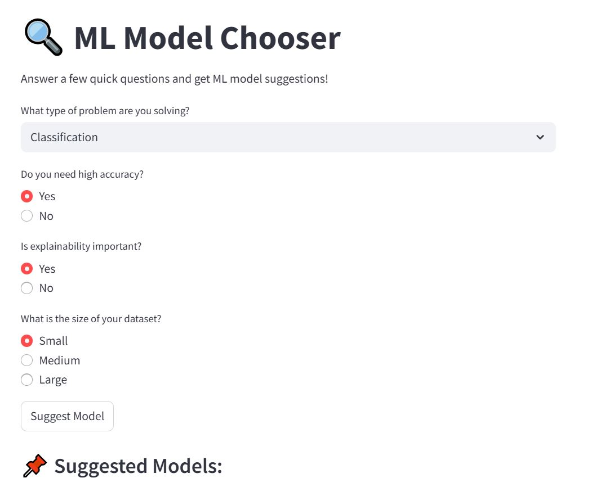

# 🤖 Model Chooser Web App

An interactive Streamlit app that helps you choose the best machine learning model based on your problem type, data size, accuracy requirements, and interpretability.

---

## 🚀 Features

- Select your problem type: Classification, Regression, Clustering, or Recommendation
- Specify constraints like data size, model explainability, and required accuracy
- Get a curated list of models suitable for your needs
- Simple, clean UI built with Streamlit

---

## 📸 Demo



---

## 📝 How to Run Locally

```bash
git clone https://github.com/luiy-coder/model-chooser-app.git
cd model-chooser-app
pip install -r requirements.txt
streamlit run app.py
```
---

## 🛠️ Tech Stack

- Python
- Streamlit
- Git + GitHub
- VSCode

---

## 🤝 Connect with Me

- 💼 [LinkedIn – Jeslin Lois](https://www.linkedin.com/in/jeslin-lois/)
---

---

## 🧠 Related Blog Posts

Here’s a deeper dive into the thoughts and learning behind this project:

1. ✍️ [How to Choose the Right Evaluation Metric – A Simple Guide](https://medium.com/@jeslinloisss/how-to-choose-the-right-evaluation-metric-for-a-model-a-simple-guide-315817d990fe)
2. 🧪 [How to choose the Right Machine Learning model — A simple, honest guide](https://medium.com/@jeslinloisss/how-to-choose-the-right-machine-learning-model-a-simple-honest-guide-3ff603f621fa)

✨ More coming soon — follow me on [Medium](https://medium.com/@jeslinloisss) for updates!

---

## 🙌 Special Thanks

To everyone who ever paused at “Which model should I use?” — this tool is for you 💛  